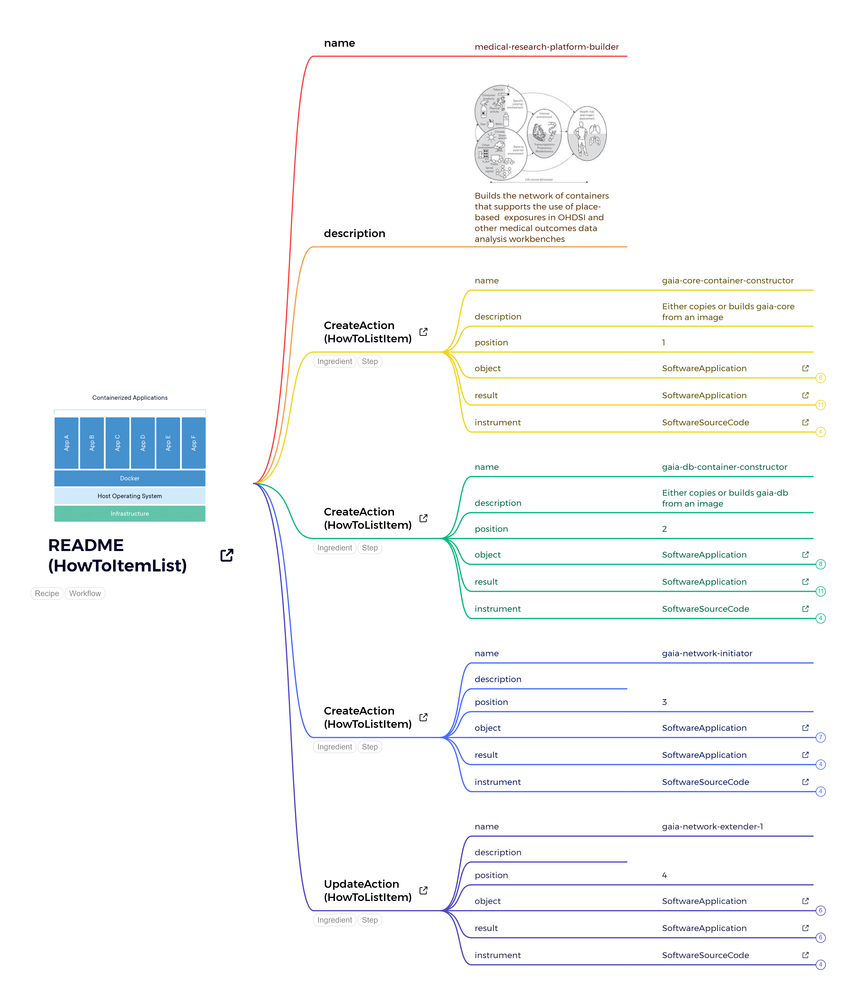

# HIV and Climate Change Working Group
This repository documents the implementation of a reproducible workflow for testing and building a research platform integrating health, climate, and social determinants of health (SDoH) data. The project leverages schemas from [schema.org](https://schema.org) to ensure structured metadata and applies FAIR principles (Findable, Accessible, Interoperable, and Reusable) to all aspects of the work.

## Objectives

1. **Test OHDSI GIS Extension**  
   Evaluate the [OHDSI GIS extension](https://www.ohdsi.org) to integrate climate data and SDoH with clinical and population health data within the OMOP Common Data Model (CDM).
   
2. **Evaluate OHDSI Containers**  
   Assess the new set of OHDSI containers, including:
   - Support for the GIS extension.
   - Integration of new vocabularies developed by the OHDSI GIS Working Group, particularly vocabularies focused on the *exposome* (environmental exposures over a person’s lifetime).

3. **Apply FAIR Principles**  
   Ensure the platform and workflows adhere to FAIR principles to enhance the usability and accessibility of the data and methods.

## Features

- **Network of Containers:**  
  Build a modular system of containers to streamline deployment and integration of the research platform. This includes:
  - Clinical and population health data processing in OMOP CDM.
  - GIS-enabled functionalities to link spatial data (e.g., climate and SDoH).
  
- **Exposome Vocabularies:**  
  Use new OHDSI vocabularies tailored to describe environmental exposures and their interactions with health data.

- **Platform Interoperability:**  
  Use schema.org to structure metadata, ensuring seamless integration and compatibility with external systems and datasets.

## Getting Started

## Repo Structure

♻️ License
---

This work is licensed under the MIT license (code) and Creative Commons Attribution 4.0 International license (for documentation).
You are free to share and adapt the material for any purpose, even commercially,
as long as you provide attribution (give appropriate credit, provide a link to the license,
and indicate if changes were made) in any reasonable manner, but not in any way that suggests the
licensor endorses you or your use and with no additional restrictions.

🤝 Acknowledgement
---

This repository has been created for anyone to reuse -- please attribute us as:
> This repository uses the template created and maintained by *The Turing Way* team members and shared under CC-BY 4.0 for reuse: https://github.com/alan-turing-institute/reproducible-project-template.

## Contributors ✨

Thanks goes to these wonderful people ([emoji key](https://allcontributors.org/docs/en/emoji-key)):

